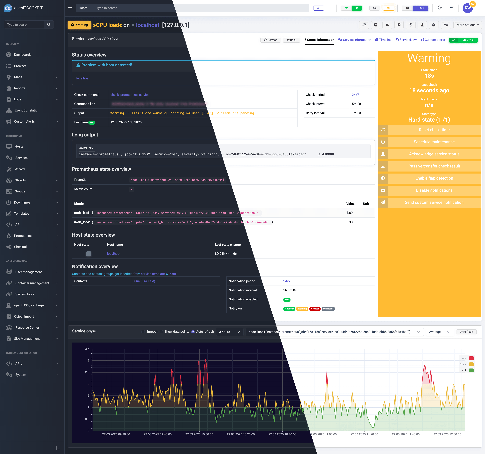
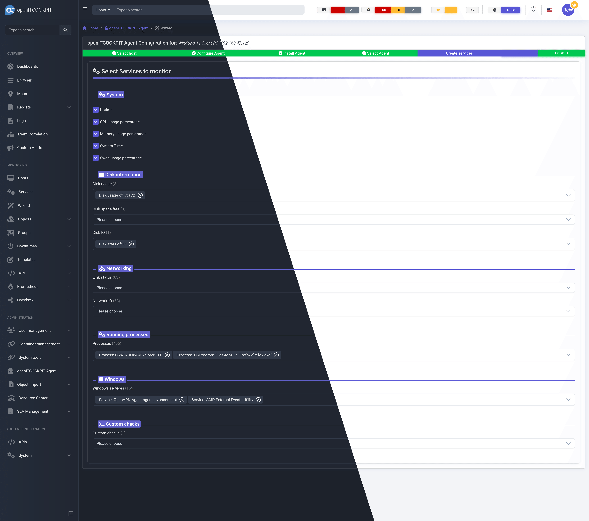

# openITCOCKPIT Frontend Angular

Next generation open source monitoring.

[](https://discord.gg/G8KhxKuQ9G)
[](https://www.reddit.com/r/openitcockpit/)
[](https://web.libera.chat/#openitcockpit)
[](https://drone.openitcockpit.io/buildStatus/icon?job=openitcockpit-packages%2Fstable&subject=stable)
[](https://drone.openitcockpit.io/buildStatus/icon?job=openitcockpit-packages%2Fnightly&subject=nightly)


# What is openITCOCKPIT?

openITCOCKPIT is an Open Source system monitoring tool built for different monitoring engines like Nagios, Naemon and Prometheus.

This is the repository for the official [openITCOCKPIT](https://openitcockpit.io/) frontend.

The backend server code that is providing the API can be found [here](https://github.com/openITCOCKPIT/openITCOCKPIT).

# Demo

Play around with our [Demo](https://demo.openitcockpit.io/) system. Its equipped with the majority of modules that you will get with the community license

Credentials:

````
Username(Email): demo@openitcockpit.io
Password: demo123
````

## Screenshots






## Production setup

If you are only interested in using openITCOCKPIT, but do not plan to do any development, the openITCOCKPIT frontend
is provided by the `openitcockpit-frontend-angular` package.

Please refer to the [official documentation](https://openitcockpit.io/download_server/) for more information about how to install openITCOCKPIT.

## Setup for Developers

The openITCOCKPIT frontend is a standalone Angular application that communicates with the [openITCOCKPIT backend](https://github.com/openITCOCKPIT/openITCOCKPIT)
via the [HTTP API](https://docs.openitcockpit.io/en/development/api/).

If you want to contribute to the openITCOCKPIT frontend, you can follow the instructions below to set up a development environment.

### Prerequisites

- Latest Node.js LTS ([Ubuntu / Debian download](https://github.com/nodesource/distributions))
- [Angular CLI](https://angular.dev/installation) installed globally
   ```
   npm install -g @angular/cli
   ```

### System requirements

The openITCOCKPIT Angular application is a relatively large application and requires a lot of resources to build and run.
We recommend at least 8 GB of RAM and 4 CPU cores.

### Nginx Configuration

To avoid any CORS issues, the frontend should be installed on an openITCOCKPIT server. The location does not matter however
`/opt/openitc/frontend-angular` is the recommended location.

To route all traffic through the Nginx web server, edit the config file `/etc/nginx/openitc/master.conf`
and commend out the `Proxy for the Angular Frontend (production)` section and uncomment the `Proxy for the Angular Frontend (development)` section.

```nginx
# Proxy for the Angular Frontend (production)
#location ^~ /a/ {
#    alias /opt/openitc/frontend-angular/browser/;
#    index index.html;
#    try_files $uri $uri/ /a/index.html;
#}

# Proxy for the Angular Frontend (development)
location ^~ /a/ {
    proxy_pass http://127.0.0.1:4200/a/;

    proxy_http_version 1.1;
    proxy_set_header Upgrade $http_upgrade;
    proxy_set_header Connection "Upgrade";

    proxy_set_header    Host                $host;
    proxy_set_header    X-Real-IP           $remote_addr;
    proxy_set_header    X-Forwarded-Host    $host;
    proxy_set_header    X-Forwarded-Server  $host;
    proxy_set_header    X-Forwarded-Proto   $scheme;
    proxy_set_header    X-Forwarded-For     $remote_addr;
    proxy_redirect off;
    proxy_connect_timeout 90s;
    proxy_read_timeout 90s;
    proxy_send_timeout 90s;
}
```

To apply the changes, restart the Nginx service.

```
systemctl restart nginx
```

### Clone the Repository

```
cd /opt/openitc/
git clone https://github.com/openITCOCKPIT/openITCOCKPIT-frontend-angular.git frontend-angular
```

You can now start the Angular development server.

```
npm install
chown www-data:www-data /opt/openitc/frontend-angular -R
```

```
npm start
```

The frontend is now available at `https://xxx.xxx.xxx.xxx/a/`.

## Build Angular Frontend for Production

```
npm install
ng build
```

## Create a new module

1. Create a new directory at `src/app/modules`, for example `jira_module`.
2. Now add a basic routes configuration for the module `jira_module/jira_module.routes.ts`

```typescript
import { Routes } from '@angular/router';

export const jiraModuleRoutes: Routes = [];
```

3. Load the routs into the Angular app: `src/app/app.routes.ts`

````typescript
/***    Routes for modules   ***/
const moduleRoutes: Routes = [
        ...eventcorrelationModuleRoutes,
        ...jiraModuleRoutes // <-- add your module routes
    ];
````

4. Inside of `src/app/modules/jira_module` you can create different sub-folders for `pages`, `services`, etc.

## Translations (i18n)

openITCOCKPIT is a multi-language frontend.
If you found errors in the translations, we are more than happy to receive pull requests.

There are different levels how you can help us to improve our translations.
All Translations are located at `src/assets/i18n/` in "JSON" files (e.g. `src/assets/i18n/de_DE.json` for German translations).
The `key` is the original English text and the `value` is the translated text. Please do **never change the key**.

```json
{
    "This is the KEY, please never change this": "This is the value and can be translated",
    "Monitoring is fun": "Monitoring macht Spaß"
}
```

The `{0}` as placeholders that will be replaced by the frontend at runtime.
It is important to use `{0}` in the key, and `{{0}}` in the value.

```json
{
    "My name is {0}": "Mein Name ist {{0}}"
}
```

openITCOCKPIT use [Transloco](https://jsverse.gitbook.io/transloco) for translations. Please refer to the official documentation for more information.

### 1. Fix typos

Found a typo, some grammar issues or a bad wording?
The easiest way to help us is to fix it directly in the JSON file. Open the corresponding JSON file (e.g. `src/assets/i18n/es_ES.json`) and search for the text you want to change.

After you have fixed the issue, please send us a pull request.

### 2. Improve or update existing translations

Sometimes, some keys are missing in the translation files. To add missing translations to existing files,
you can run the command `npm run i18n:find`. This will add all missing keys with the English text as value.

For example `src/assets/i18n/de_DE.json`:

```json
{
    "Marked for re-enable": "Marked for re-enable"
}
```

You can now start to translate all english texts to German:

```json
{
    "Marked for re-enable": "Zum Wiederaktivieren markiert"
}
```

### 3. Add new translations

If you plan to add a new language, you need to add the new language to the `transloco.config.js` file.
For example add `it_IT` for Italian translations:

```javascript
langs: ['...', 'uk_UA', 'it_IT']
```

Now, create a empty JSON file in the `src/assets/i18n/` folder with the name `it_IT.json`.

```sh
echo "{}" > src/assets/i18n/it_IT.json
```

and run the `npm run i18n:find` command to add all missing keys.

You can now translate all keys to Italian.

```json
{
    "Username": "Nome utente",
    "Password": "Parola d'ordine",
    "Login": "Accesso"
}
```

In the last step, you have to add the new language to the `src/app/app.config.ts` file.

```ts
 availableLangs: ['...', 'uk_UA', 'it_IT']
```

and add the new language into the dropdown menu `src/app/layouts/coreui/change-language/change-language.component.html`

## How to Upgrade Angular

This document describes how to upgrade the underlying Angular version.

1. Update CoreUI
   Please see the official CoreUI documentation on how to update the Angular
   version: https://coreui.io/angular/docs/migration/angular-version/ first.
   Copy and modify the shown upgrade command. This example upgrades from Angular 19 to Angular 20.

   Probably it's a good idea to also add `angular-fontawesome`, `@fullcalendar/angular`, `ng-select` and
   `ng-option-highlight` to this list as well. We can test this with the next Angular upgrade.

    ```
    ng update @angular/core@20 @angular/cli@20 @angular/cdk@20 @coreui/angular@~5.5 @coreui/icons-angular@~5.5 primeng@20.0.1 @primeng/themes@20.0.1
    ```

Check the terminal for any errors.

2. Follow the Update Guide from https://angular.dev/update-guide and check for any breaking changes
3. Update other dependencies
   openITCOCKPIT uses a lot of other dependencies that need to be updates as well.
    ````
   npm i --save @fortawesome/angular-fontawesome@latest @fullcalendar/angular@latest @ng-select/ng-select@latest @ng-select/ng-option-highlight@latest
    ````

4. Update all dependencies from `package.json`

    ```
    npm install -g npm-check-updates
    ncu
    ncu --upgrade
    npm install
    ```

   Angular is very picky when it comes to TypeScript versions, so make sure to keep the currently used TypeScript
   version.

```
npm install --save typescript@~5.5.3
```

### How to Upgrade Font Awesome

Wherever we combine `Font Awesome` with `vis-network`, to actually work, we reference the specific webfont to use for the `icon`s in the `options` object.

```typescript
// [...]
icon: {
    face: '"Font Awesome 7 Free"',   // Here we changed the string from "Font Awesome 6 Free" to "Font Awesome 7 Free"
        code
:
    '\uf0ac',
        color
:
    colorGroup, //color for icon,
        weight
:
    "900", // Font Awesome 5 doesn't work properly unless bold. // Font Awesome 6 fix https://github.com/visjs/vis-network/issues/139#issuecomment-536114158

}
// [...]
```

# Need help or support?

* Official [Discord Server](https://discord.gg/G8KhxKuQ9G)
* Join [#openitcockpit](https://web.libera.chat/#openitcockpit) on Libera Chat
* [Allgeier IT Services GmbH](https://www.allgeier-its.com/) provides commercial support

# Security

Please send security vulnerabilities found in openITCOCKPIT or software that is used by openITCOCKPIT to: `security@openitcockpit.io`.

All disclosed vulnerabilities are available here: [https://openitcockpit.io/security/](https://openitcockpit.io/security/)

# License

```
Copyright (C) 2015-2025  it-novum GmbH
Copyright (C) 2025-today Allgeier IT Services GmbH


openITCOCKPIT is dual licensed

1)
This program is free software: you can redistribute it and/or modify
it under the terms of the GNU General Public License as published by
the Free Software Foundation, version 3 of the License.


This program is distributed in the hope that it will be useful,
but WITHOUT ANY WARRANTY; without even the implied warranty of
MERCHANTABILITY or FITNESS FOR A PARTICULAR PURPOSE.  See the
GNU General Public License for more details.


You should have received a copy of the GNU General Public License
along with this program.  If not, see <http://www.gnu.org/licenses/>.

2)
If you purchased an openITCOCKPIT Enterprise Edition you can use this file
under the terms of the openITCOCKPIT Enterprise Edition licence agreement.
Licence agreement and licence key will be shipped with the order
confirmation.
```
