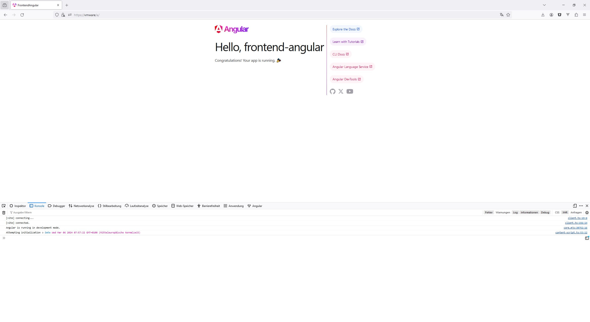

# openITCOCKPIT Frontend Angular

**THIS IS WORK IN PROGRESS!** Do not use for production! You have been warned.



## Setup

Für das Frontend wird die aktuelle Node LTS Version benötigt. Falls Node noch nicht installiert ist, kann dies (für
Ubuntu / Debian) hier rüber erfolgen: https://github.com/nodesource/distributions
Bitte nach `Node.js LTS` suchen.

Das Frontend ist ein **Standalone Frontend**, welches ausschließlich über die API mit openITCOCKPIT kommuniziert.

### Angular installieren

```
npm install -g @angular/cli
```

### Nginx Konfiguration

Damit es zu keinen CORS Problemen kommt, wird das Frontend auf einem openITCOCKPIT Server installiert. Der Ort ist
egal (`/opt/openitc/frontend-angular` zum Beispiel)

Der gesamte Traffik wird über den Nginx Webserver gerouted. Dazu folgendes in die Datei `/etc/nginx/openitc/custom.conf`
eintragen

```
# Proxy for /a/ Angular frontend
location ^~ /a/ {
    proxy_pass http://localhost:4200/a/;

    proxy_http_version 1.1;
    proxy_set_header Upgrade $http_upgrade;
    proxy_set_header Connection "Upgrade";

    proxy_set_header    Host                $host;
    proxy_set_header    X-Real-IP           $remote_addr;
    proxy_set_header    X-Forwarded-Host    $host;
    proxy_set_header    X-Forwarded-Server  $host;
    proxy_set_header    X-Forwarded-Proto   $scheme;
    proxy_set_header    X-Forwarded-For     $remote_addr;
    proxy_redirect off;
    proxy_connect_timeout 90s;
    proxy_read_timeout 90s;
    proxy_send_timeout 90s;
}
```

Den Restart vom Webserver nicht vergessen

```
systemctl restart nginx
```

### Repo Clonen

Jetzt muss noch das Repositoriy geclonted werden.

```
cd /opt/openitc/
git clone https://github.com/it-novum/openITCOCKPIT-frontend-angular.git frontend-angular
```

Das Frontend kann jetzt über npm gestartet werden.

```
npm install
chown www-data:www-data /opt/openitc/frontend-angular -R
```

```
sudo -u www-data -g www-data /bin/bash
ng serve
```

cd ..

## Netzwerkzugriff

### NFS Share

Benutzer von NFS müssen einen neuen Export in der Datei `/etc/exports` erstellen

```
/opt/openitc/frontend-angular/    172.16.17.0/24(rw,no_subtree_check,no_root_squash,all_squash,anonuid=33,anongid=33) 172.16.12.0/24(rw,no_subtree_check,no_root_squash,all_squash,anonuid=33,anongid=33) 128.1.0.0/16(rw,no_subtree_check,no_root_squash,all_squash,anonuid=33,anongid=33)  192.168.56.0/24(rw,no_subtree_check,no_root_squash,all_squash,anonuid=33,anongid=33) 192.168.178.0/24(rw,no_subtree_check,no_root_squash,all_squash,anonuid=33,anongid=33) 10.212.134.0/24(rw,no_subtree_check,no_root_squash,all_squash,anonuid=33,anongid=33)
```

Aktiviert wird der neue Export über

```
exportfs -a
```

### Windows / SMB Share

Unter Windows, bzw. wenn die Samba-Freigabe genutzt wird, sind keine Anpassungen erforderlich.

Original Angular Readme (unten)

# How to Upgrade Angular

This document describes how to upgrade the underlying Angular version.

1. Update CoreUI
   Please see the official CoreUI documentation on how to update the Angular
   version: https://coreui.io/angular/docs/migration/angular-version/ first.
   Copy and modify the shown upgrade command. This example upgrades from Angular 18 to Angular 20.

   Probably it's a good idea to also add `angular-fontawesome`, `@fullcalendar/angular`, `ng-select` and
   `ng-option-highlight` to this list as well. We can test this with the next Angular upgrade.

    ```
    ng update @angular/core@19 @angular/cli@19 @angular/material@19 @coreui/angular@~5.3 @coreui/icons-angular@~5.3 primeng@19.0.2 @primeng/themes@19.0.2
    ```

   Check the terminal for any errors.

2. Follow the Update Guide from https://angular.dev/update-guide and check for any breaking changes
3. Update other dependencies
   openITCOCKPIT uses a lot of other dependencies that need to be updates as well.
    ````
   npm i --save @fortawesome/angular-fontawesome@latest @fullcalendar/angular@latest @ng-select/ng-select@latest @ng-select/ng-option-highlight@latest
    ````

---

# FrontendAngular

This project was generated with [Angular CLI](https://github.com/angular/angular-cli) version 17.2.2.

## Development server

Run `ng s --disable-host-check  --public-host --host=0.0.0.0` for a dev server. Navigate to `http://localhost:4200/`.
The application will automatically reload if you change any of the source files.

## Code scaffolding

Run `ng generate component component-name` to generate a new component. You can also use
`ng generate directive|pipe|service|class|guard|interface|enum|module`.

## Build

Run `ng build` to build the project. The build artifacts will be stored in the `dist/` directory.

## Running unit tests

Run `ng test` to execute the unit tests via [Karma](https://karma-runner.github.io).

## Running end-to-end tests

Run `ng e2e` to execute the end-to-end tests via a platform of your choice. To use this command, you need to first add a
package that implements end-to-end testing capabilities.

## Further help

To get more help on the Angular CLI use `ng help` or go check out
the [Angular CLI Overview and Command Reference](https://angular.io/cli) page.
